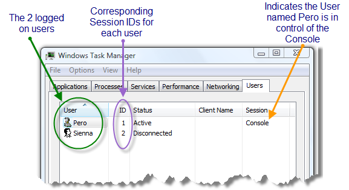
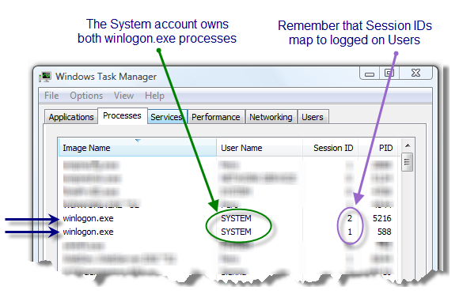
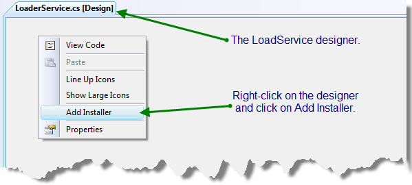
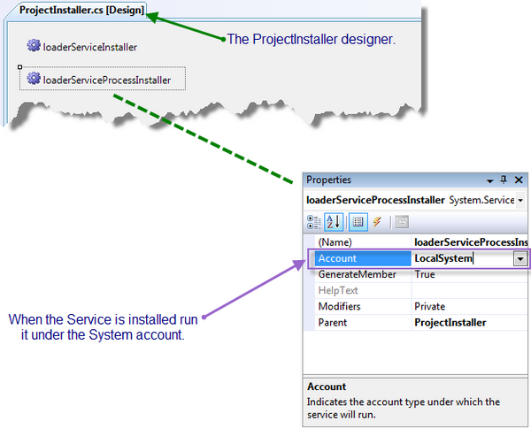
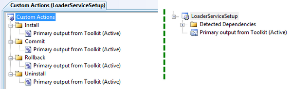
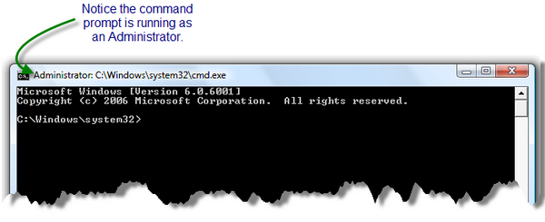
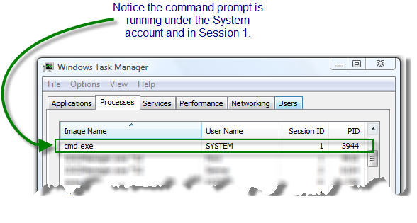
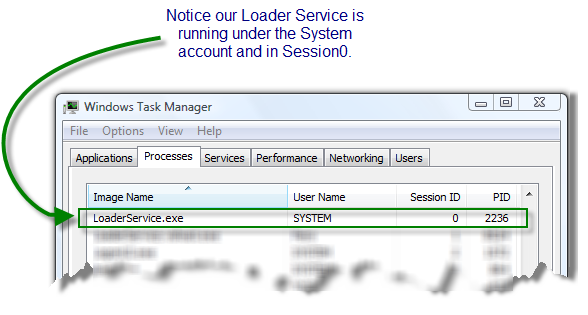

# Preamble

Presenting my authored article and code from 2009, initially published on [CodeProject](https://www.codeproject.com/Articles/35773/Subverting-Vista-UAC-in-Both-32-and-64-bit-Archite) and now being migrated to GitHub with the code in its original form.

# Introduction

The purpose of this article is to illustrate how to correctly launch an interactive process from a service in Windows Vista, and also to demonstrate how to launch that process with full Administrator privileges. An interactive process is one that is capable of displaying a UI on the desktop.

The article shows how to create a service called _LoaderService_ that serves as an application loader and whose purpose is to launch, at boot time, a command prompt that runs as an Administrator. The article closes with a section discussing how the code could be extended for more practical purposes.

# Sessions in Vista

Let’s start from the beginning… you have just booted up your computer and are about to log on. When you log on, the system assigns you a unique Session ID. In Windows Vista, the first User to log on to the computer is assigned a Session ID of 1 by the OS. The next User to log on will be assigned a Session ID of 2. And so on and so forth. You can view the Session ID assigned to each logged on User from the Users tab in Task Manager:



Notice, I indicated that the User named Pero is in control of the Console. In this case, I mean the Physical Console. The Physical Console consists of the monitor, keyboard, and mouse. Since Pero is in control of the keyboard, monitor, and mouse, he is considered the currently active User. However, since Users can be impersonated, it is more appropriate to reference the currently active Session rather than the currently active User. The Win32 API contains a function called `WTSGetActiveConsoleSessionId()` which returns the Session ID of the User currently in control of the Physical Console. If we were to call that method right now, it would return a value of 1 because that is the Session ID of the User Pero.

There exists a special Session in Vista that has a Session ID of 0. This is commonly referenced as Session0. All Windows Services run within Session0, and Session0 is non-interactive. Non-interactive means that UI applications cannot be launched; however, there is a way around this by activating the Interactive Services Detection Service (ISDS). This not a very elegant solution, and will not be covered in this article. There is a quick 5 minute [Channel 9 video](http://channel9.msdn.com/posts/Charles/Session-0-Changes-and-Vista-Compatibility-for-Services-running-as-Interactive-with-Desktop/) that demonstrates the ISDS for those interested. This article assumes the absence of the ISDS. Now, because Session0 is not a User Session, it does not have access to the video driver, and therefore any attempts to render graphics will fail. Session0 isolation is a security feature added in Vista to isolate system processes and services from potentially malicious user applications.

This is where things get interesting. The reason for this isolation is because the System account (or System User) has elevated privileges that allow it to run unhindered by the restrictions of Vista UAC. If everything were running under the System account, Vista UAC might as well be turned off.

Now, I know what you’re thinking, “If Windows Services run in Session0, and Session0 cannot start processes that have a UI, then how can our loader service spawn a new process that not only has a UI, but that also runs within the currently logged on User’s Session?” Take a look at this screenshot from the Processes tab in Task Manager, and pay particular attention to the _winlogon.exe_ processes:



Notice there are two _winlogon.exe_ processes, and the User who owns both of those processes is the System User. The System User is a highly privileged User unhindered by the Vista UAC that we were talking about earlier. Also, notice the Session IDs that indicate within which Sessions the _winlogon.exe_ processes are running. If you remember from earlier, Session ID 1 refers to the User Pero’s Session, and Session ID 2 refers to the User Sienna’s Session. This means that there is a _winlogon.exe_ process running under the System account within Pero’s Session. It also means that there is a _winlogon.exe_ process running under the System account within Sienna’s Session. This is the appropriate time to mention that any Session with an ID greater than 0 is capable of spawning an interactive process, which is a process capable of displaying a UI.

The solution may not be totally clear yet, but it will be shortly, as now it is time to discuss our strategy!

# Our Strategy

First, we are going to create a Windows Service that runs under the System account. This service will be responsible for spawning an interactive process within the currently active User’s Session. This newly created process will display a UI and run with full admin rights. When the first User logs on to the computer, this service will be started and will be running in Session0; however the process that this service spawns will be running on the desktop of the currently logged on User. We will refer to this service as the _LoaderService_.

Next, the _winlogon.exe_ process is responsible for managing User login and logout procedures. We know that every User who logs on to the computer will have a unique Session ID and a corresponding _winlogon.exe_ process associated with their Session. Now, we mentioned above, the _LoaderService_ runs under the System account. We also confirmed that each _winlogon.exe_ process on the computer runs under the System account. Because the System account is the owner of both the _LoaderService_ and the _winlogon.exe_ processes, our _LoaderService_ can copy the access token (and Session ID) of the _winlogon.exe_ process and then call the Win32 API function `CreateProcessAsUser` to launch a process into the currently active Session of the logged on User. Since the Session ID located within the access token of the copied _winlogon.exe_ process is greater than 0, we can launch an interactive process using that token.

Now for the fun stuff… the code!

# The Code

The Windows Service is located in a file called _LoaderService.cs_ within the _Toolkit_ project. Below is the code that gets called when the `LoaderService` is started:

```csharp
protected override void OnStart(string[] args)
{
    // the name of the application to launch
    String applicationName = "cmd.exe";

    // launch the application
    ApplicationLoader.PROCESS_INFORMATION procInfo;
    ApplicationLoader.StartProcessAndBypassUAC(applicationName, out procInfo);
}
```

The code above calls the `StartProcessAndBypassUAC(...)` function which will launch a command prompt (with full admin rights) as part of a newly created process. Information about the newly created process will get stored into the variable `procInfo`.

The code for `StartProcessAndBypassUAC(...)` is located in the file _ApplicationLoader.cs_. Let’s dissect that function to examine how a service running in Session0 will load a process into the currently logged on User’s Session. To begin, we will obtain the Session ID of the currently logged on User. This is achieved by making a call to the Win32 API function `WTSGetActiveConsoleSessionId()`.

```csharp
// obtain the currently active session id; every logged on 
// User in the system has a unique session id
uint dwSessionId = WTSGetActiveConsoleSessionId();
```

Next, we will obtain the Process ID (PID) of the _winlogon.exe_ process for the currently active Session. Remember, there are two Sessions currently running, and if we copy the access token of the wrong one, we could end up launching our new process on another User’s desktop.

```csharp
// obtain the process id of the winlogon process that 
// is running within the currently active session
Process[] processes = Process.GetProcessesByName("winlogon");
foreach (Process p in processes)
{
    if ((uint)p.SessionId == dwSessionId)
    {
        winlogonPid = (uint)p.Id;
    }
}
```

Now that we have obtained the PID of the _winlogon.exe_ process, we can use that information to obtain its process handle. To do so, we make a Win32 API call to `OpenProcess(...)`:

```csharp
// obtain a handle to the winlogon process
hProcess = OpenProcess(MAXIMUM_ALLOWED, false, winlogonPid);
```

Having acquired the process handle, we can make a Win32 API call to `OpenProcessToken(...)` to obtain a handle to the access token of the _winlogon.exe_ process:

```csharp
// obtain a handle to the access token of the winlogon process
if (!OpenProcessToken(hProcess, TOKEN_DUPLICATE, ref hPToken))
{
    CloseHandle(hProcess);
    return false;
}
```

With a handle to the access token, we can proceed to call the Win32 API function `DuplicateTokenEx(...)` which will duplicate the access token:

```csharp
// Security attribute structure used in DuplicateTokenEx and CreateProcessAsUser
// I would prefer to not have to use a security attribute variable and to just 
// simply pass null and inherit (by default) the security attributes
// of the existing token. However, in C# structures are value types and therefore
// cannot be assigned the null value.
SECURITY_ATTRIBUTES sa = new SECURITY_ATTRIBUTES();
sa.Length = Marshal.SizeOf(sa);

// copy the access token of the winlogon process; 
// the newly created token will be a primary token
if (!DuplicateTokenEx(hPToken, MAXIMUM_ALLOWED, ref sa, 
        (int)SECURITY_IMPERSONATION_LEVEL.SecurityIdentification, 
        (int)TOKEN_TYPE.TokenPrimary, ref hUserTokenDup))
{
    CloseHandle(hProcess);
    CloseHandle(hPToken);
    return false;
}
```

There are many advantages to duplicating an access token. Most notable in our case is that we have a new copy of a primary access token which also contains within it the associated logon Session of that copied token. If you refer to the Task Manager screenshot above that shows the two _winlogon.exe_ processes, you will notice that the duplicated Session ID will be 1, which is the Session ID of the currently logged on User, Pero. We can now call the Win32 API function `CreateProcessAsUser` to spawn a new process within the Session of the currently logged on User; in this case, the process will spawn in the Session of the User Pero. To summarize, the code below runs in Session0, but will launch a new process in Session 1:

```csharp
STARTUPINFO si = new STARTUPINFO();
si.cb = (int)Marshal.SizeOf(si);

// interactive window station parameter; basically this indicates 
// that the process created can display a GUI on the desktop
si.lpDesktop = @"winsta0\default";

// flags that specify the priority and creation method of the process
int dwCreationFlags = NORMAL_PRIORITY_CLASS | CREATE_NEW_CONSOLE;

// create a new process in the current User's logon session
bool result = CreateProcessAsUser(hUserTokenDup,  // client's access token
                                null,             // file to execute
                                applicationName,  // command line
                                ref sa,           // pointer to process SECURITY_ATTRIBUTES
                                ref sa,           // pointer to thread SECURITY_ATTRIBUTES
                                false,            // handles are not inheritable
                                dwCreationFlags,  // creation flags
                                IntPtr.Zero,      // pointer to new environment block 
                                null,             // name of current directory 
                                ref si,           // pointer to STARTUPINFO structure
                                out procInfo      // receives information about new process
                                );
```

The above code will launch a command prompt that is running as an Administrator under the System account. I’d like to comment on the parameter `@"winsta0\default"`. This is a hard-coded `String` that Microsoft arbitrarily chose to indicate to the OS that the process we are about to spawn in `CreateProcessAsUser` should have full access to the interactive windowstation and desktop, which basically means it is allowed to displayed UI elements on the desktop.

That’s all there is to the code. Now, let’s discuss how to deploy this service using an MSI, and how to configure it to launch automatically when the computer boots up!

# Deploying the Code

The most efficient way to deploy our code is to create an MSI installer for it. However, we have to first perform a couple of tasks to prepare our service for installation. To begin, we need to add an installer for our _LoaderService_. To add an installer, open up the _LoaderService.cs_ designer. Then, right-click, and select Add Installer:



The above action adds a new class to the project called `ProjectInstaller`. This class inherits from the `Installer` class. There are two components visible on the designer of _ProjectInstaller.cs_ that I have renamed for clarity to `loaderServiceProcessInstaller` and `loaderServiceInstaller`. The `loaderServiceProcessInstaller` control allows us to specify the account under which the _LoaderService_ will run. This account has been set to _System_:



Now, we are ready to add a Setup project. The primary output of the Setup project is set to the _Toolkit_ project, which contains our _LoaderService_. This step is fairly trivial, and I will not be going through the details of adding it. However, I would like to comment that we need to hook up the `ProjectInstaller` class to this MSI. If we do not, then the contents of the _Toolkit_ project will be deployed, but the _LoaderService_ will not get registered as a Windows Service. To add a custom action, right-click on the Setup project and go to View > Custom Actions. From here, you can add a custom action. Specifying the custom action as the primary output from _Toolkit_ is enough to hint to it that there is a custom installer, in our case `ProjectInstaller`, that needs to be run. Remember, `ProjectInstaller` is the installer class actually responsible for registering the service with Windows:



Now, it's time to run the code and see the fruits of our labor!

# Running the Code

To verify the code is working as expected, we will build the MSI and install it. When you install the MSI, you will notice a UAC prompt asking you to confirm the install. A good Marine friend of mine once told me the Marines have a saying, "Once a Marine, always a Marine." In hacking and computer security, that would translate to, "Once an Administrator, always an Administrator." This is the one and only time a User who installs your project will be presented with a UAC pop-up. Since most MSIs need Administrator privileges to install, this should come as no shock to the User.

After installation, you will notice the service has been registered to start automatically (by the `ProjectInstaller`); however, this will only happen on the next reboot. You can also start it manually. This article assumes you have chosen to reboot. Notice, when the computer reboots, you are displayed with a command prompt that is running as an Administrator:



From here, you can type in _regedit_, _gpedit.msc_, or whatever command you like, and it will bypass the Vista UAC prompt. What’s more is that the currently logged in User need not even be an Administrator to take advantage of this command prompt. The reason being is that the command prompt is running under the System account. This can be seen from the Task Manager in the screenshot below. Also take note of the Session ID:



But, what about our _LoaderService_? Where is it, and under which Session is it running? Let’s take another look at Task Manager to figure this out:



We have just successfully bypassed Vista UAC and illustrated how to correctly spawn an interactive process from a Windows Service. But, there is more we can do!

# Beyond the Fundamentals

The topics discussed in this section are not contained in the downloadable code. The reason being to keep the example solution as simple as possible. The ideas below are meant to illustrate how the example code can be extended to support different types of scenarios.

## A Generic Solution

Most Windows Services are started when the first User logs on to the computer, and they are launched in Session0. The way our code is currently written is such that only the first User who logs on to the computer will have the command prompt launched in their Session. The reason for this is that our `LoaderService` spawns the process from its `OnStart` function. The `OnStart` function executes only once, and that is when the service is first started. Since the first User to log on to the system has the net effect of starting all services in Session0, he is the User whose Session ID will be retrieved in the `OnStart` function when it calls `StartProcessAndBypassUAC`. The `OnStart` function in _LoaderService.cs_ has been repeated below for clarity:

```csharp
protected override void OnStart(string[] args)
{
    // the name of the application to launch
    String applicationName = "cmd.exe";

    // launch the application
    ApplicationLoader.PROCESS_INFORMATION procInfo;
    ApplicationLoader.StartProcessAndBypassUAC(applicationName, out procInfo);
}
```

So then, how can we configure our `LoaderService` to launch the command prompt for every User on the computer the first time that they log on? The solution is in the `OnStart` function: either wire-up a `Timer`, or spawn a `Thread` that runs in an infinite loop every so many seconds (`Thread.Sleep(1000)` can be used to control how often the `Thread` runs). We can use a `List<int>` object to keep track of all the Session IDs that we have already launched our process in. Every time our `Thread` executes, we check to see if the Session ID has changed. The currently active Session ID can be retrieved by calling `WTSGetActiveConsoleSessionId()`. If the Session ID has changed, we check to see if we have launched our process into that Session. If we have not, then we call `StartProcessAndBypassUAC` and add the Session ID to the `List<int>` object.

## Launching an Application On Demand

It may be the case that you do not want your application to start immediately when Users log on to the computer. You may have an application that should only be loaded when the User chooses to run it. In addition, you may want this application and functionality to be available to every User on the system. The question then is how can our `LoaderService` accommodate this while still bypassing Vista UAC?

Before we begin this discussion, let’s quickly talk about how UAC applies with regard to file and folder access. Vista supports the notion of Special Folders. There are several Special Folders in Vista, but the one we are going to focus on is the _Documents_ folder. In .NET, you can query Special Folder locations by calling `Environment.GetFolderPath(...)`.

If you spend enough time on your computer, you may have noticed that you can freely create, modify, and delete files located in your _Documents_ folder without any interference from UAC. However, if you navigate to another User’s _Documents_ folder, you will be greeted with a UAC prompt asking for an Administrator’s permission to touch the folder. You may have also noticed that there is a public _Documents_ folder shared and accessible by all Users. In Vista, the path to this Special Folder is _C:\\Users\\Public\\Documents_. Any User on the system can freely create, modify, and delete files located here without any interference from UAC.

Now, we are able to craft a solution! We can modify the `OnStart` function of our `LoaderService` to start an instance of the `FileSystemWatcher` class, and configure it to watch for changes to the public _Documents_ folder, which all Users have access to. We will have to create a new Console application to communicate with the `LoaderService` via text files (do not confuse this Console application with the Console Session). The code for the Console application will look like the following:

```csharp
static void Main(string[] args)
{
    string filename = @"C:\Users\Public\Documents\appToLoad.txt";
    using (StreamWriter sw = new StreamWriter(filename, false))
    {
        sw.WriteLine("SessionID=" + WTSGetActiveConsoleSessionId());
        sw.WriteLine("ApplicationToLoad=cmd.exe");
        sw.Close();
    }
}
```

Upon seeing the file _appToLoad.txt_, the `LoaderService` would parse the file and launch a command prompt in the currently active Session. At this point, we have successfully illustrated how to use a user application to communicate with a service, and how to have it launch an application for us with full Administrator rights and also bypassing Vista UAC in the process.

References
----------

*   [Launch your app into session 1 using a service helper application written in C#](VistaSessionsC_.aspx)
*   [Impact of Session 0 Isolation on Services and Drivers in Windows Vista, Whitepaper](http://www.microsoft.com/whdc/system/vista/services.mspx)

History
-------

*   21/04/2009: Initial release.